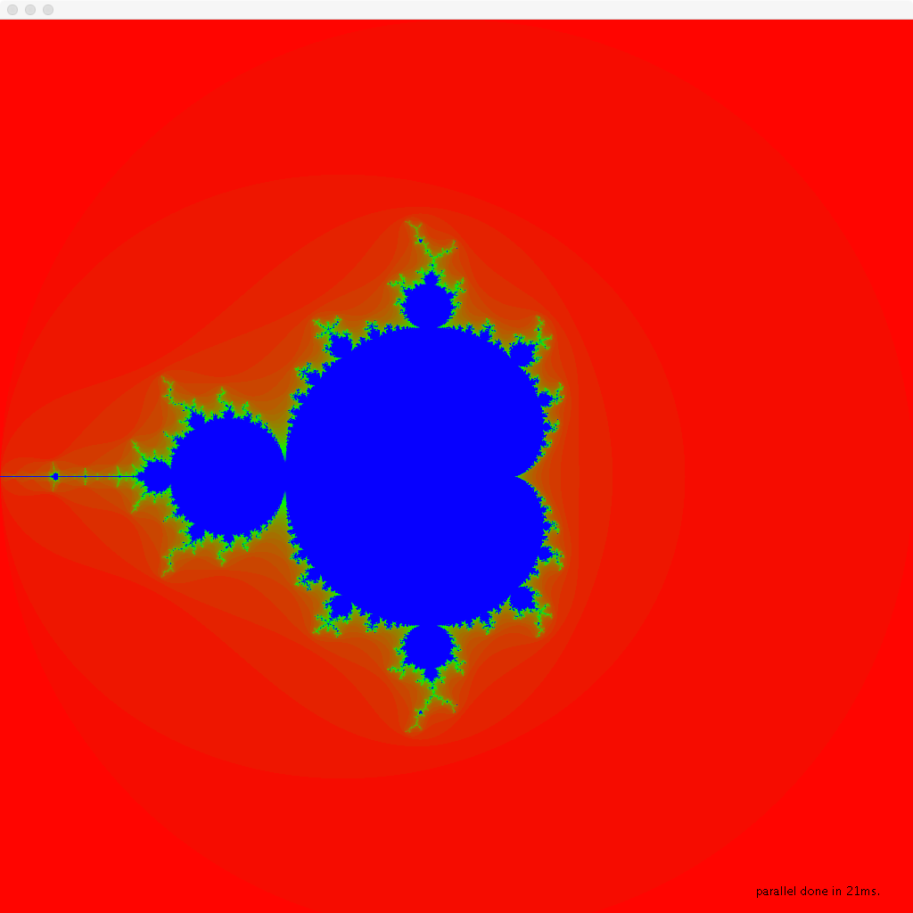

# mandelbrot

Renders the famous [Mandelbrot fractal](https://en.wikipedia.org/wiki/Mandelbrot_set) in parallel using multiple CPU cores, using the `java.util.concurrent` [Fork/Join](https://docs.oracle.com/javase/tutorial/essential/concurrency/forkjoin.html) framework.

To compile:

```
javac Mandelbrot.java
```

To render sequentially:

```
java Mandelbrot
```

To render in parallel:

```
java Mandelbrot -p
```

To show a grid of pixel areas allocated to each leaf task (showing what pixels can get calculated in parallel):

```
java Mandelbrot -p -g
```

Rendered output:



On my 8-core MBP, renders in approximately 35 milliseconds sequentially and approximately 20 milliseconds in parallel (using vanilla ForkJoinPool settings).

This code was originally written as part of my university course on [Multicore Programming](http://soft.vub.ac.be/~tvcutsem/multicore/) to show students a textbook example of an "embarrasingly parallel" computation that can be nicely sped up using the Fork/Join abstraction.